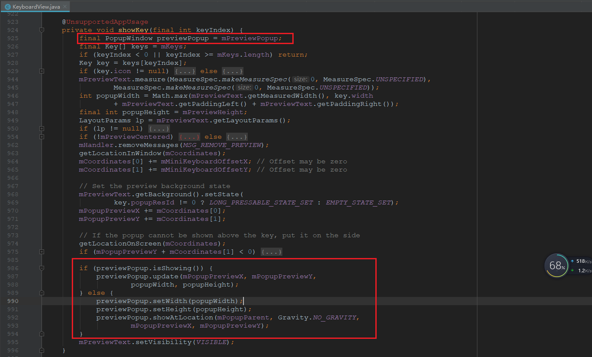
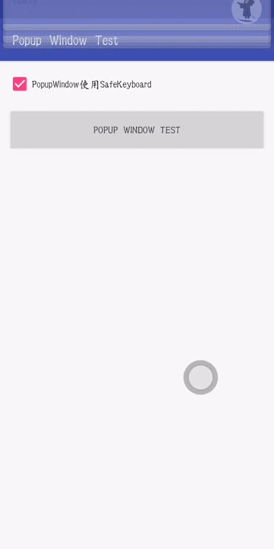
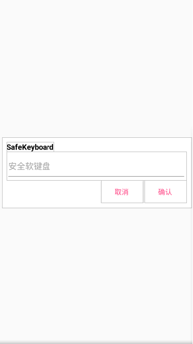
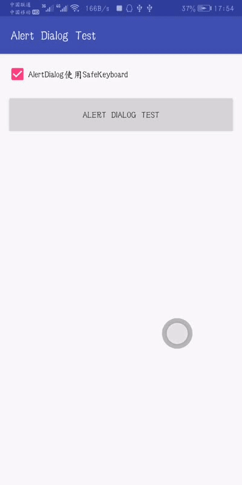
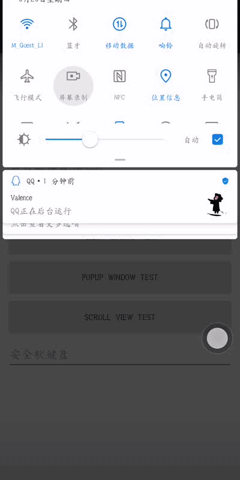
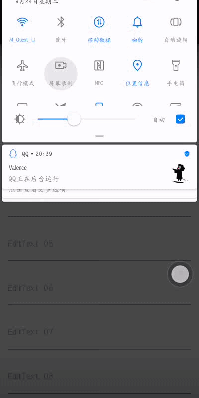

# **SafeKeyboard 注意事项**

## **一、 几种特殊页面需要使用 `SafeKeyboard` 的解决方案**

### （一）. `PopupWindow` 中使用 `SafeKeyboard`

#### 1. 崩溃问题

使用的过程中会出现 `app` 崩溃的现象, 并报一下错误 :

```java
android.view.WindowManager$BadTokenException: Unable to add window -- token android.view.ViewRootImpl$W@714366e for displayid = 0 is not valid; is your activity running?
        at android.view.ViewRootImpl.setView(ViewRootImpl.java:936)
        at android.view.WindowManagerGlobal.addView(WindowManagerGlobal.java:398)
        at android.view.WindowManagerImpl.addView(WindowManagerImpl.java:131)
        at android.widget.PopupWindow.invokePopup(PopupWindow.java:1463)
        at android.widget.PopupWindow.showAtLocation(PopupWindow.java:1225)
        at android.widget.PopupWindow.showAtLocation(PopupWindow.java:1192)
        at android.inputmethodservice.KeyboardView.showKey(KeyboardView.java:986)
        at android.inputmethodservice.KeyboardView.access$100(KeyboardView.java:68)
        at android.inputmethodservice.KeyboardView$1.handleMessage(KeyboardView.java:377)
        at android.os.Handler.dispatchMessage(Handler.java:112)
        at android.os.Looper.loop(Looper.java:216)
        at android.app.ActivityThread.main(ActivityThread.java:7625)
        at java.lang.reflect.Method.invoke(Native Method)
        at com.android.internal.os.RuntimeInit$MethodAndArgsCaller.run(RuntimeInit.java:524)
        at com.android.internal.os.ZygoteInit.main(ZygoteInit.java:987)
```

根据查看 `KeyboardView.java` 源码发现 `KeyboardView` 中实现预览 `Preview` 功能也是使用的 `PopupWindow` , 源代码如下 : 
<br><br>


`Android` 里在 `PopupWindow` 中不能再弹出 `PopupWindow`, 所以这里会出现崩溃的问题. 那么解决方案就是, 在代码里主动关闭 `SafeKeyboard` 的预览 `Preview` 功能.

```java 
    safeKeyboard.setForbidPreview(true);

    /**
     * SafeKeyboard.java
     * 设置是否强制关闭预览功能
     * <p>
     * 解释：因为系统自带的 KeyboardView 的按键预览功能是使用 PopupWindow 来实现的, 那么在
     * PopupWindow 中使用了 SafeKeyboard (本软键盘), 那么必须关闭预览, 否则会直接崩溃.
     * ( 即调用 setForbidPreview(true) )
     *
     * @param forbidPreview 是否关闭预览
     */
    public void setForbidPreview(boolean forbidPreview) {
        this.forbidPreview = forbidPreview;
    }
```

#### 2. 无法监听返回键问题

* 如果你需要点击返回键的时候先隐藏 `SafeKeyboard` 软键盘, 再次点击返回时突出 `PopupWindow` 界面

* 那么适配过程中会发现无论是在 `PopupWindow` 还是在 `Fragment` 亦或是 `Activity` 中, 都无法监听到返回键的操作事件

* 在网上查了很多资料, 包括 : 
  <br> 给 `PopupWindow` 的 `Inflate View` 加上 `OnkeyListener` ; 
  <br> 重写`onBackPress()` 、 `OnKeyDown(...)` 、等 ;
  <br> 均无法实现 .
* 原因 : 
  <br> `PopupWindow` 中给传入的 `mContentView` 包装为 `mBackgroundView` ;
  <br> 进而创建一个 `PopupWindow` 中的内部类 `PopupDecorView` 的对象 ;
  <br> `PopupDecorView` 继承于 `FrameLayout` , 内部处理了 `dispatch` 事件, 阻止了事件往下级分发 . 
* 为解决这个问题, 经过分析, 事件分发最终都是需要调用 `dismiss()` , 那么我们就可以重写 `dismiss()` 方法 ( 以前我也是一脸懵逼, 后来发现简单的一匹 ... 还是对 `Java` 不够了解 ). 如下 : 
  
```java
    // 直接重写 dismiss(), 修改 dismiss 逻辑
    mPopWindow = new PopupWindow(windowView, ViewGroup.LayoutParams.MATCH_PARENT, ViewGroup.LayoutParams.MATCH_PARENT) {
        @Override
        public void dismiss() {
            if (safeKeyboard != null && safeKeyboard.stillNeedOptManually(false)) {
                safeKeyboard.hideKeyboard();
                return;
            }
            super.dismiss();
        }
    };
```

#### 3. 效果图


至此我们就可以在 `PopupWindow` 这一级解决这个问题 . 

### （二）. `AlertDialog` 中使用 `SafeKeyboard`

`AlertDialog` 显示时是显示在所有 `View` 的上层, 所以无法对 `SafeKeyboard` 进行操作. 这里提供的解决方案为 : 使用 `DialogFraagment` , 在 `DialogFragment` 中的自定义布局文件中 : 

* 1. 重新实现一个类似于 `AlertDialog` 的布局, 使 `SafeKeyboard` 有位置可以显示并操作 .
  <br>样式图如下 : ( 详见 : `layout_dialog_fragment.xml` )
  <br><br>
  
  <br><br>

* 2. 在 1 中完成布局后, 显示的 `DialogFragment` 不是全屏显示的, 那么就需要手动调整 . 
  <br><br> ① 代码操作 : 
  ```java
        // 使 Dialog 全屏显示的代码
        Dialog dialog = getDialog();
        if (dialog != null) {
            int width = ViewGroup.LayoutParams.MATCH_PARENT;
            int height = ViewGroup.LayoutParams.MATCH_PARENT;
            Window window = dialog.getWindow();
            if (window != null) {
                window.setLayout(width, height);
            }
        }
  ```
  因为用到 `getDialog()` , 所以需要在 `Dialog` 对象创建完成后才会使 `getDialog()` 不为空, 即在 `Fragment` 生命周期的 `Fragment.CREATE` 后调用上述代码即可
  <br><br> ② 需要 `Style` 代码配合可以去除全屏后左右边界间隙的问题.
  ```java
    // Java代码中在重新实现的 DialogFragment 中 OnCreate 方法调用 : 
    setStyle(STYLE_NO_FRAME, R.style.DialogFragment_FullScreen); 
    // R.style.xxx 为自定义属性, 属性值参考 : styles.xml 文件
  ```
  ```xml
    <!-- styles.xml 文件 -->
    <style name="DialogFragment.FullScreen" parent="Theme.AppCompat.Dialog">
        <item name="android:padding">0dp</item>
        <item name="android:windowBackground">@color/deepDarkTransparent</item>
    </style>
  ```

* 3. 同样的, 我们会遇到和 `PopupWindow` 相同的返回键事件问题, 那么为了解决这个问题, 我们需要重写 `Dialog` 中的 `dismiss()` 方法
  <br> 这就又会出现另一个问题, 没有 `Dialog` 对象 ; 
  <br> 查看代码后发现, 创建 `Dialog` 对象的代码仅有一处, 而且非常简单 : 
  ```java
    // DialogFramgent.java 文件
    public Dialog onCreateDialog(Bundle savedInstanceState) {
        return new Dialog(getActivity(), getTheme());
    }
  ```
  那么我们就可以重写该方法, 并套用 `PopupWindow` 中的办法 : 
  ```java
    /**
     * SafeKeyboardDialogFragment.java 文件
     * 重写此方法是为了实现点击返回时, 如果 SafeKeyboard 处于显示状态, 先隐藏再 dismiss dialog
     *
     * @param savedInstanceState ...
     * @return ...
     */
    @NonNull
    @Override
    public Dialog onCreateDialog(Bundle savedInstanceState) {
        return new Dialog(getActivity(), getTheme()) {
            @Override
            public void dismiss() {
                if (ignoreCondition) {
                    ignoreCondition = false;
                    super.dismiss();
                } else if (safeKeyboard != null && safeKeyboard.stillNeedOptManually(false)) {
                    safeKeyboard.hideKeyboard();
                } else super.dismiss();
            }
        };
    }
  ```

* 4. 效果图
<br><br>


至此解决 `AlertDialog` 中使用 `SafeKeyboard` 的问题


## **二、 关于 `SafeKeyboard` 显示后遮挡 `EditText` 的解决方案**

### （一）. 经过一段时间的思考, 最后决定使用 : 把整个被遮挡 `EditText` 的父布局整体往屏幕上方顶起的解决方案 . 

#### 1. 新需求 :

需要传入目标 `EditText` 的父布局的 `View` 对象 . 
<br> 参考 `SafeKeyboard` 构造方法 : 

```java
    /**
     * SafeKeyboard 构造方法, 传入必要的参数
     *
     * @param mContext            上下文Context
     * @param keyboardParentView  界面上显示 SafeKeyboard 的 View
     * @param keyboardLayoutResId SafeKeyboard 样式资源 id
     * @param mSafeKeyboardViewId 自定义的 SafeKeyboardView id
     * @param rootView            含有使用了 SafeKeyboard 的 EditText 的界面根布局 View
     * @param scrollLayout        目标 EditText 父布局 View
     *                            ( 多个 EditText 共用 SafeKeyboard 但其直接父布局不是同一个 View 时, 传入公共父布局)
     * @param letterWithNum       字母键盘是否带有数字
     */
    SafeKeyboard(Context mContext, LinearLayout keyboardParentView, int keyboardLayoutResId, int mSafeKeyboardViewId,
                 @NonNull View rootView, @NonNull View scrollLayout, boolean letterWithNum) {
        ...
    }
```

#### 2. 实现 “顶起” 逻辑
均使用 TranslateAnimation 实现上下移动动画效果, 参考下面三个方法 :
```java
    /**
     * 顶起
     */
    private void doScrollLayout() {
        ...
    }

    /**
     * 回落
     * @param isHide    回落的同时, SafeKeyboard 是否隐藏
     */
    private void doScrollLayoutBack(final boolean isHide, EditText mEditText) {
        ...
    }

    /**
     * @param mEditText 目标 EditText
     */
    private void editNeedScroll(EditText mEditText) {
        ...
    }
```

效果图 :



#### 3. 当 `EditText` 需要被 “顶起” 遇到 `EditText` 被 `ScrollView` 包裹时

<font color=red size=8>以下问题已不复存在</font></br>
* 当出现上述情况时, 创建 `SafeKeyboard` 对象传入 `ScrollView` 或者 `ScrollView` 的直接子布局 `View` 时, 动画效果都会出现问题 ; 
* 为解决该问题, 我们可以在 `ScrollView` 上再包一层 `View` 并传入 `SafeKeyboard` . 
  
</br>
<font color=red size=8>以上问题已不复存在</font></br>

已采用其他办法实现 `EditText` 被顶起逻辑. 不需要再在 `ScrollView` 上再包一层 `View` 

需要在 `AndroidManifest` 文件的 `Activity` 节点下增加: `android:windowSoftInputMode="stateAlwaysHidden|adjustPan"` 以优化显示和效果

示例:
```xml
    <activity
            android:name=".ScrollViewEditActivity"
            android:windowSoftInputMode="stateAlwaysHidden|adjustPan" />
```


效果图 :



至此解决 `SafeKeyboard` 遮挡 `EditText` 以及 特殊的遇到 `ScrollView` 等问题

<font color=red size=8>顶起逻辑已完善</font></br>
